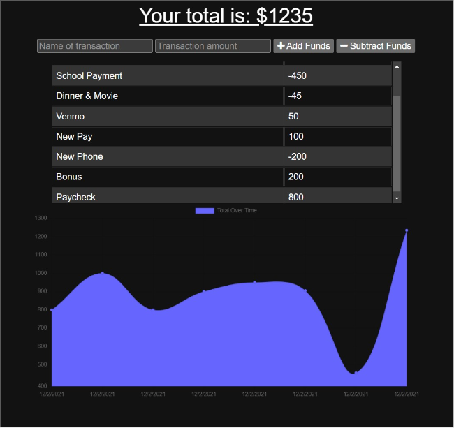
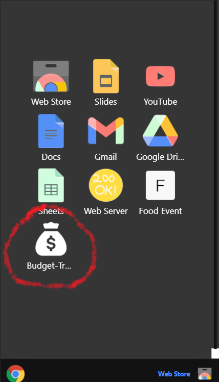

# Budget Tracker (Progressive Web Application)


## Description

The purpose of this project is to update an existing budget tracker application by providing offline access and functionality. After offline persistence is added, the application allows the user to add expenses and deposits to their budget with or without a connection to the internet. If the user enters transactions offline, the total is updated when they're brought back online.

The application uses [IndexedDB API](https://developer.mozilla.org/en-US/docs/Web/API/IndexedDB_API) for client-side storage of transactions made offline. This is made possible through the use of service workers and manifests that give the application offline functionality from cached data on front-end and back-end. Once the application comes back online, the transaction data is uploaded to the [MongoDB](https://cloud.mongodb.com/) database. Also, because this is a mobile-first application, the web manifest allows users to install the app on the home screen with the app's metadata.

## Table of Contents

-  [User Story](#user-story)
-  [Acceptance Criteria](#acceptance-criteria)
-  [Application Output Example](#application-output-example)
-  [Project URLs](#project-urls)
-  [License](#license)
-  [Questions](#questions)

## User Story

```
AS AN avid traveler
I WANT to be able to track my withdrawals and deposits with or without a data/internet connection
SO THAT my account balance is accurate when I am traveling
```

## Acceptance Criteria

```
GIVEN a budget tracker without an internet connection
WHEN the user inputs an expense or deposit
THEN they will receive a notification that they have added an expense or deposit
WHEN the user reestablishes an internet connection
THEN the deposits or expenses added while they were offline are added to their transaction history and their totals are updated
```

## Application Output Example





## Project URLs

-  The URL of the GitHub repository:
   https://github.com/JoseEPina/budget-tracker

-  The URL of the deployed application:
   https://joseepina-budget-tracker.herokuapp.com/

## License

Copyright (c) 2021 Jose E Pina. All rights reserved.

Licensed under the [MIT License](https://choosealicense.com/licenses/mit).

## Questions

Budget Tracker created by [JoseEPina](https://github.com/JoseEPina).

For any additional questions or comments, please send a message to the following address:

GitHub Email Address: <jose.edpina@gmail.com>
